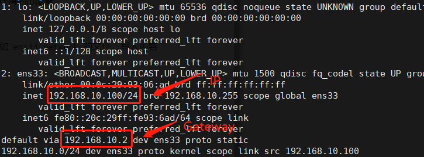

Archlinx设置静态ip (systemd-networkd)

1. 用`ip addr`和`ip route` 查看当前通过dhcp获得的ip配置



2. 在 `/etc/systemd/network/` 目录下创建 形如 `ens33.network` 的文件，写入内容

   ```
   [Match]
   Name=ens33
   [Network]
   #DHCP=ipv4 
   Address=192.168.10.100/24
   Gateway=192.168.10.2
   DNS=180.76.76.76
   DNS=114.114.114.114
   
   ```

   

3. 重启systemd-networkd服务  (删除netctl及其启动项)